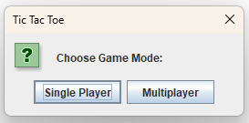
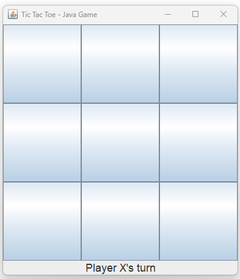
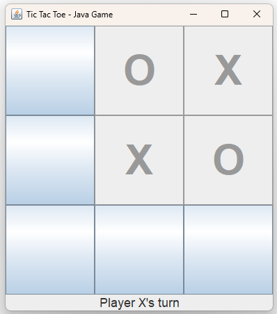
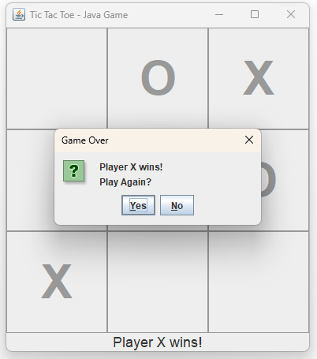

# ❌⭕ Tic Tac Toe – Java Swing Game

A clean, beginner-friendly **Tic Tac Toe** game built with **Java Swing**. This version includes **Single Player** (vs Computer) and **Multiplayer** (Player vs Player) modes.

---

## 🎮 Game Features

- ✅ **Single Player Mode** with basic AI  
- ✅ **Multiplayer Mode** (local, 2 players)  
- ✅ Interactive **Swing GUI**  
- ✅ Easy-to-use button-based interface  
- ✅ Visual win/tie indication  
- ✅ Responsive restart functionality  

---

## 📸 Screenshot







## 🧩 Requirements

Make sure you have the following installed:

- **Java Development Kit (JDK)** – [Download JDK](https://www.oracle.com/java/technologies/javase-downloads.html)  
- Optional: A Java IDE such as **DrJava**, **IntelliJ IDEA**, **Eclipse**, or **NetBeans**

---

## 📦 Installation & Running

### 1. Clone the repository

```bash
git clone https://github.com/yourusername/java-tic-tac-toe.git
cd java-tic-tac-toe
